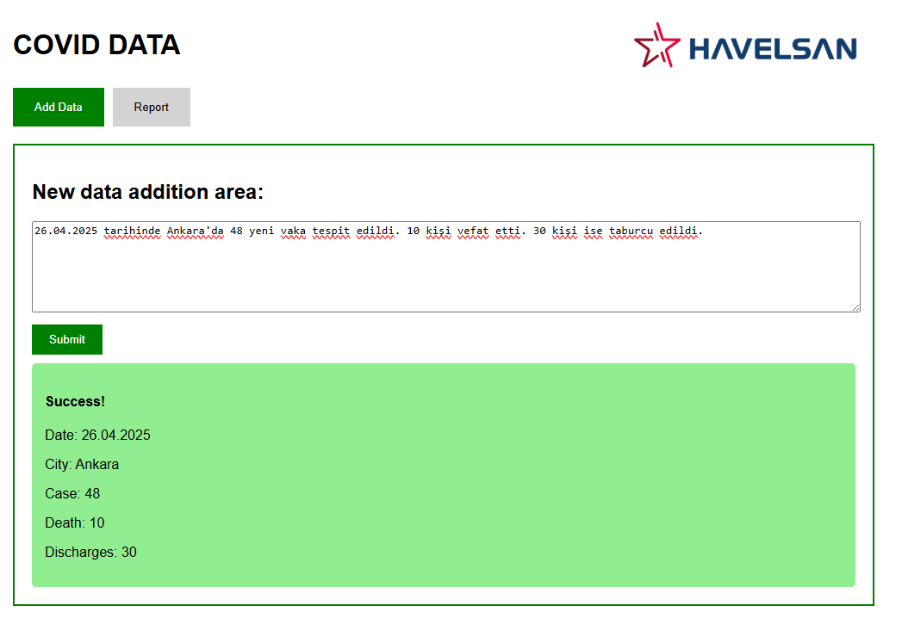
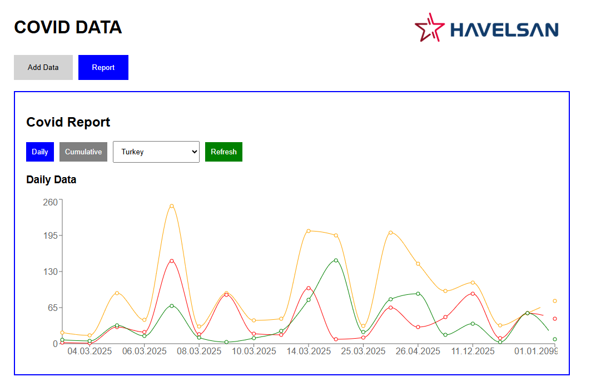
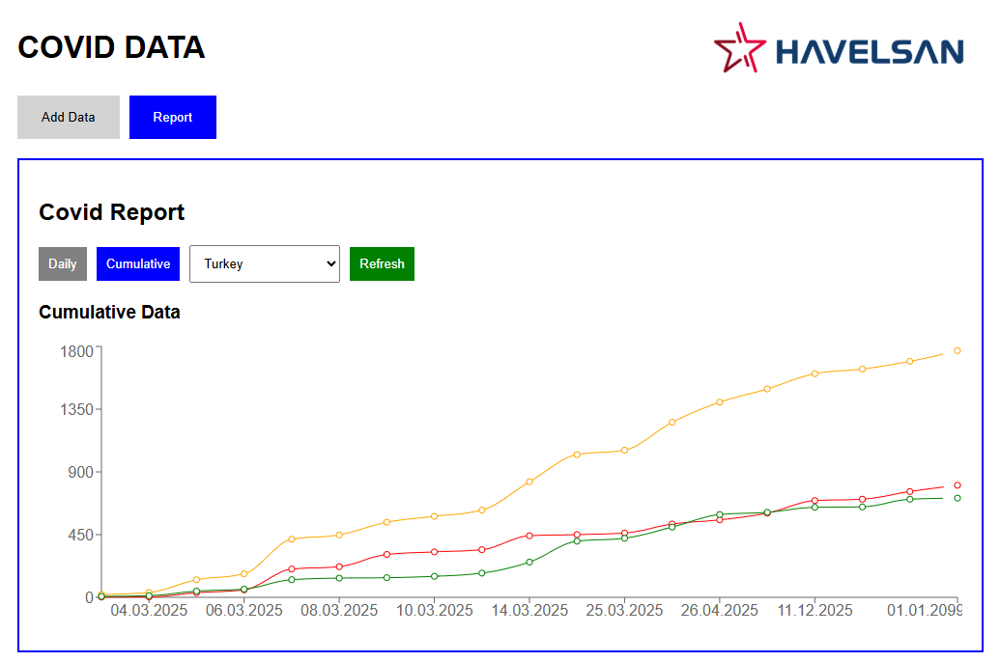
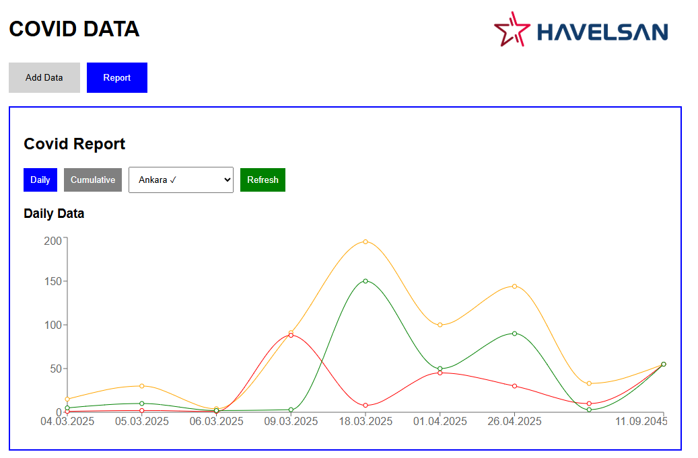
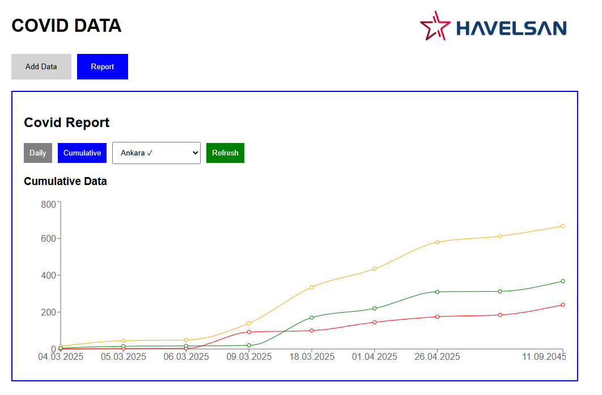

# Getting Started:

This project enables the processing of Covid-19 news by providing user input. News text is parsed to obtain meaningful datasets. This data is reported in graphical format.

This project has been developed and tested using the following tools and versions:

## Installed Technologies

| Technology  | Version   | Notes |
|-------------|-----------|-------|
| **Node.js** | 22.17.1   | LTS   |
| **npm**     | 10.9.2    |       |
| **Java**    | 21        | LTS   |
| **Maven**   | 3.9.11    |       |
| **MongoDB** | 8.0.12    |       |
| **Mongosh** | 2.5.6     |       |
| **Git**     | 2.50.1    |       |

> **Note:** Please make sure the versions above are installed on your system before working with this project.

# Libraries
Required libraries for React:
- **npm install axios**
- **npm install recharts**

> The requirements for Spring will be automatically provided by Maven with pom.xml.

## Local Development Environment Configuration

| Technology     | Host        | Port  | Description                 |
|----------------|-------------|-------|-----------------------------|
| MongoDB        | localhost   | 27017 | MongoDB Community Server    |
| React          | localhost   | 3000  | React Development Server    |
| Spring Boot    | localhost   | 8080  | Backend API Server          |

> Tip: I added the test data I used locally to the "Test Dataset" folder. It can be used as the base data for the charts in the React interface. If you want to use it, you can import it directly into the database using MongoDB Compass.

## 📦 Database Table Attributes

The following attributes are used in the MongoDB collection for storing COVID-related news and statistics:

| Attribute         | Description                             |
|------------------|-----------------------------------------|
| **_id**          | Unique identifier for each document     |
| **date**         | The date value in the input data        |
| **caseCount**    | Number of confirmed cases          |
| **deathCount**   | Number of reported deaths         |
| **dischargesCount** | Number of discharged or recovered  |
| **theNews**      | Original input data |

# User Interface

### New Data

### All Data Report - Daily

### All Data Report - Cumulative 

### City Report - Daily

### City Report - Cumulative
